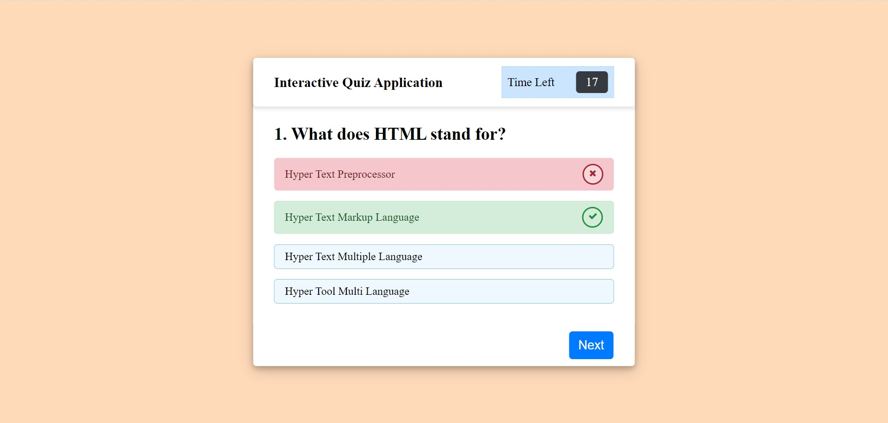

# 04-Interactive-Coding-Quiz
This contains the Module 4 challenge of the Rice Coding Bootcamp

## Description

An application that is a timed coding quiz with multiple choice questions. The app runs in the browser and features dynamically updated HTML and CSS powered by custom Javascript. 

## Main Site

## Location of Repository

The source code is found in the index.html file, the css code can be found within assets/css/, the js code can be found within assets/js/. All relevant images will be contained in the assets/images folder. 

## Link to Depolyed Application

The link to the deployed application can be found here: https://cnguyen1013.github.io/04-Interactive-Coding-Quiz/